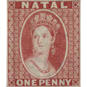

# AlbumEasy Stamp Collection Syntax Highlighting

[](https://freddyouellette.com) [](https://github.com/freddyouellette/albumeasy-syntax-highlighting)



Syntax Highlighting for the program ["AlbumEasy"](https://www.thestampweb.com/albumeasy), which is a way to programmatically make page designs for stamp albums. 

I created this because I think editing these files in VS Code is easier and you get more tools to work with.

## Installation
* To enable the syntax highlighting for the current file, click on the "Language Mode" button in the toolbar to the bottom right of the VS Code window.
* You can also rename your file to have the extension `.stamps` to automatically choose this highlighting.
* **TIP:** Using the [Trigger Task on Save](https://marketplace.visualstudio.com/items?itemName=Gruntfuggly.triggertaskonsave) extension, you can trigger a task to build the PDF on every save of the file. Add this to `.vscode/tasks.json`:
```json
{
	"version": "2.0.0",
	"tasks": [
		{
			"label": "build",
			"type": "shell",
			"command": "/Applications/AlbumEasy.app/Contents/MacOS/AlbumEasy -c \"${file}\""
		}
	]
}
```

* and add this to your vscode settings:

```
"triggerTaskOnSave.tasks": {
	"build" : [
		"*.stamps",
	]
},
```
* **TIP:** Using the [vscode-pdf](https://marketplace.visualstudio.com/items?itemName=tomoki1207.pdf) extension, you can have the pdf open in the same window and see it refresh as you save the file.

## Problems, Questions, Suggestions? 
* I encourage all issues or suggestions to be submitted through the [**Issues** tab on GitHub](https://github.com/freddyouellette/albumeasy-syntax-highlighting/issues).
* Pull requests are welcome.

## Support Me
[](https://www.paypal.com/donate/?hosted_button_id=3PJ9XD363CC5E)

Bitcoin: `bc1qs39glh9cwsef0qv40dny6ajnweqe2le7ynfgr2`

Ethereum: `0x5Baba8708b8676afBFF2974b4af4894Fc12aE242`